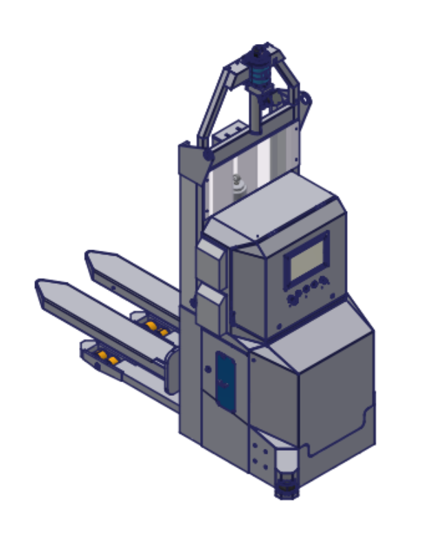
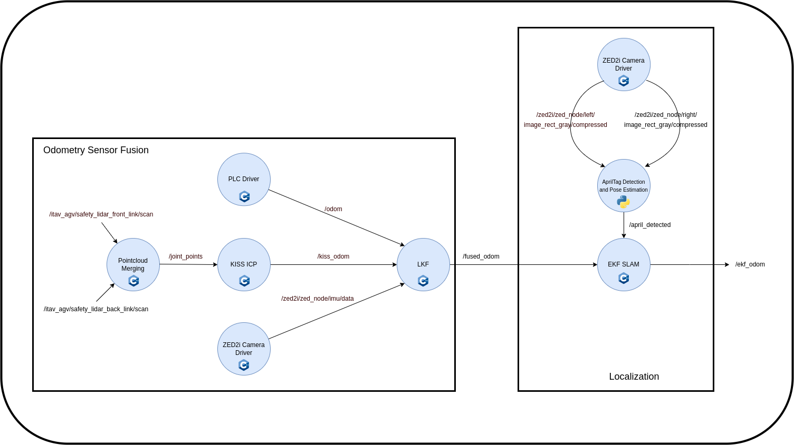

# Master Thesis - Multimodal Sensor Fusion For Robot Localization in an Industrial Environment


About:

<p align="center">

</p>
<figcaption align="center"><b>Figure 1. TAVIL ITAV AGV: Robotic Platform for Testing the Algorithm</b></figcaption>
</figure>

This project contains a set of packages for solving the localization problem for an autonomoous forklift using both a Linear Kalman Filter and an Extended Kalman Filter. The sensors to be fused include wheel encoders, LiDAR odometry and IMU measurements fo have an odometry robust to drift. Artificial Fiducial Markers were located in the environment for the robot to perceive them and relocalize when in initialization, lost or to correct accumulated drift along a given trajectory.


## Main Contributors:

This project has been carried out by:

* [](https://www.github.com/enriquea52) [Enrique Aleman]


## Code Structure
```bash
├── aprilTag_detection
│   ├── april_detect
│   └── april_detect_msgs
├── images
│   └── itav_diagram.drawio.png
├── itav_sim
│   ├── itav_description
│   └── itav_gazebo
├── kalmanFiltering
│   ├── ekf_interfaces
│   └── ekf_ros
├── pointcloud_proc
│   ├── kiss-icp
│   └── point_merger
└── README.md

```

## Required Packages

The system is self contained, the only external package used is KISS-ICP, which is already included in this project with the proper modificiations for the given purpose. 

## How to use it:

Go to your ROS_workspace/src directory

```bash
  $ cd ~/ros2_ws/src
```

Clone the project or extact the compressed file in ros2_ws/src directory 

```bash
  $ git clone https://github.com/enriquea52/master-thesis.git
```

Go back to ROS_workspace directory

```bash
  $ cd ../ros2_ws
```

Run colcon build with symlinks

```bash
  $ colcon build --symlink-install
  $ source ./ros2_ws/install/setup.bash
```

## Software Architecture

<p align="center">

</p>
<figcaption align="center"><b>Figure 2. ROS software architecture</b></figcaption>
</figure>


## Parameters:

### Kinematic Model Parameters
- kinematic_params.l: Kinematic Model Wheelbase
- kinematic_params.r:  Kinematic Model Wheel Radius
- kinematic_params.a: Kinematic Model Wheel Offset


### Maps Path 

- maps_path: Absolute Path to where the Maps are to be Saved

### Topics 

- odometry_topic: Topic to Subscribe for the Prediction Step in the EKF SLAM
- tag_topic: Topic to Subscribe for the Upda Step in the EKF SLAM
- joint_states_topic: Traction Wheel Velocity and Steering Angle Raw Sensor Measurements 

- stereo_frame_id: Frame Corresponding to the Stereo Optical Frame

- icp_topic: Topic from where the LiDAR Odometry is Published (using the KISS ICP algorithm comes) 

- imu_topic: Topic from where the IMU Raw Data is Published 

- output_fusion_topic: Topic to Publish the Fused Odometry

- right_img_topic: Topic where the Right Image from a Stereo Camera is being Published
- left_img_topic: Topic where the Left Image from a Stereo Camera is being Published


- april_detections_topic: Topic to Publish the Detected Fiducial Markers 

### Uncertainty Parameters

- motion_covariance.std_v: Uncertainty in the Linear Velocity used for rediction.
- motion_covariance.std_w: Uncertainty in the Angular Velocity used for rediction

- tag_covariance.std_x: Uncertainty in the landmakr Measurement in the x Direction.
- tag_covariance.std_y: Uncertainty in the landmakr Measurement in the y Direction.
- tag_covariance.std_z: Uncertainty in the landmakr Measurement in the z Direction.

- camera_pose_wrt_base.x: Camera Pose with Respect the Mobile Base (x Direction)
- camera_pose_wrt_base.y: Camera Pose with Respect the Mobile Base (y Direction)
- camera_pose_wrt_base.z: Camera Pose with Respect the Mobile Base (z Direction)

- pred_cov.std_v: Uncertainty Propagation of the Linear Velocity over a Fixed Time Interval
- pred_cov.std_w: Uncertainty Propagation of the Angular Velocity over a Fixed Time Interval

- enc_cov.std_v: Uncertainty Propagation of the Linear Velocity coming from the Wheel Encoders.
- enc_cov.std_w: Uncertainty Propagation of the Angular Velocity coming from the Wheel Encoders.

- icp_cov.std_v: Uncertainty Propagation of the Linear Velocity coming from the LiDAR Odometry.
- icp_cov.std_w: Uncertainty Propagation of the Angular Velocity coming from the LiDAR Odometry.

- imu_cov.std_w: Uncertainty Propagation of the Angular Velocity coming from Raw IMU Measurements.

### AprilTag Detection Parameters

- total_tags: Total Number of AprilTags to be Located in the Environment.

- time_window: Time Filtering Window.

- quad_decimate: Decimation Coefficient for Tag Enhancement.

- quad_sigma: Gaussian Blur Coefficient

- decode_sharpening: Image Edge Sharpening

- tag_size: AprilTag Side Length Size in Meters.

- camera_intrinsics.fx: Camera's Focal Length in the x Direction.
- camera_intrinsics.fy: Camera's Focal Length in the y Direction.
- camera_intrinsics.cx: Camera's Central Point in the x Direction.
- camera_intrinsics.cy: Camera's Central Point in the y Direction.
- camera_intrinsics.b: Camera's Baseline.

- triangulation_stds.x: Triangulation Pose Estimation Uncertainty in the x Direction
- triangulation_stds.y: Triangulation Pose Estimation Uncertainty in the y Direction
- triangulation_stds.z: Triangulation Pose Estimation Uncertainty in the z Direction

- homography_stds.x: Homography Pose Estimation Uncertainty in the x Direction
- homography_stds.y: Homography Pose Estimation Uncertainty in the y Direction
- homography_stds.z: Homography Pose Estimation Uncertainty in the z Direction

## Topics:

The following is a description of the  topics involved for the functionality of the system as presented in Figure 2. the camera to be used in the project is the ZED2i, for which most of the topics related to sensor readings (images and IMU) follow the zed namespace.

- ~itav_agv/safety_lidar_front_link/scan ([sensor_msgs/msg/LaserScan](https://docs.ros2.org/latest/api/sensor_msgs/msg/LaserScan.html)): Front laser scan from safety LiDAR.

- ~itav_agv/safety_lidar_back_link/scan ([sensor_msgs/msg/LaserScan](https://docs.ros2.org/latest/api/sensor_msgs/msg/LaserScan.html)): Rear laser scan from safety LiDAR.

- ~joint_points ([sensor_msgs/msg/PointCloud2](https://docs.ros2.org/latest/api/sensor_msgs/msg/PointCloud2.html)): Combined laser scans converted to a pointclouds.

- ~odom ([nav_msgs/msg/Odometry](https://docs.ros2.org/foxy/api/nav_msgs/msg/Odometry.html)): Wheel Encoder Odometry.

- ~kiss_odom ([nav_msgs/msg/Odometry](https://docs.ros2.org/foxy/api/nav_msgs/msg/Odometry.html)): LiDAR odometry comming from merged pointclouds and the KISS ICP algorithm.

- ~fused_odom ([nav_msgs/msg/Odometry](https://docs.ros2.org/foxy/api/nav_msgs/msg/Odometry.html)): Wheel odometry + LiDAR odometry + IMU angular velocity

- ~ekf_odom ([nav_msgs/msg/Odometry](https://docs.ros2.org/foxy/api/nav_msgs/msg/Odometry.html)): Fused Odometry + AprilTag iducial marker correction.

- ~zed2i/zed_node/imu/data ([sensor_msgs/msg/Imu](https://docs.ros2.org/latest/api/sensor_msgs/msg/Imu.html)): 9 DoF IMU raw data


- ~zed2i/zed_node/left/image_rect_gray/compressed ([sensor_msgs/msg/CompressedImage](https://docs.ros2.org/latest/api/sensor_msgs/msg/CompressedImage.html)): Compressed rectified left image from the stereo camera (ZED2i) in grayscale.

- ~zed2i/zed_node/right/image_rect_gray/compressed ([sensor_msgs/msg/CompressedImage](https://docs.ros2.org/latest/api/sensor_msgs/msg/CompressedImage.html)): Compressed rectified right image from the stereo camera (ZED2i) in grayscale.

- ~april_detect (april_detect_msgs/msg/Detections): Custom message to transport detected tags in the front-end to the back-end.

## Available Services:

- ~ekf/set_pose (ekf_interfaces/srv/SetPose): Service to set the pose estimation of the EKF SLAM algorithm to a desired quantity.

- ~ekf/reset (ekf_interfaces/srv/SetPose): Service to set the pose estimation of the EKF SLAM algorithm to a desired quantity and resseting both the state vector (landmarks) and the covairance matrix.

- ~ekf/save (ekf_interfaces/srv/SaveMap): Service to save the map (set of landmarks, ids and covariance)

- ~ekf/load (ekf_interfaces/srv/LoadMap): Service to load the map (set of landmarks, ids and covariance). It initializes the covariance of the robot very large in order to pay attention to the existing landmarks for relocalization.

## Provided TFs:

- odom &rarr; base_link

